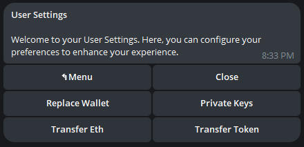

# 🥂 Transfer ETH & Tokens


The ability to transfer ETH & tokens is currently exclusive to the Telegram Bot. This feature will be integrated into Bro Bot X in a future update.


### How to access

1. `/menu` in the [Telegram bot](https://t.me/unibotsniper\_bot).
2. Click `⚙️ Settings`.
3. Click `Transfer Eth` or `Transfer Token` as desired.&#x20;

### **Interface**



<figure><figcaption>
Transfer ETH
</figcaption></figure>

<figure><figcaption>
Select Wallet W1, W2, W3
</figcaption></figure>

* From Wallet: Select the Bro Token wallet you wish to send ETH from.&#x20;
* To Wallet: Choose the Bro Token wallet you want to send ETH to, or input a custom address.
* &#x20;Transfer Amount: Select from preset ETH amounts, enter a custom amount, or opt to send all ETH from the chosen wallet.&#x20;
* Send Transfer: Upon clicking, your transfer will be executed immediately.




<figure><figcaption>
Transfer Token
</figcaption></figure>

<figure><figcaption>
Select Wallet W1, W2, W3
</figcaption></figure>

* From Wallet: Choose the Bro Token wallet you want to send tokens from.&#x20;
* To Wallet: Select the Bro Token wallet you wish to send tokens to, or enter a custom address.
* &#x20;Transfer Percent: Pick from preset percentage amounts of the token to send.&#x20;
* Select Token: The tokens held by each of your wallets are listed numerically.&#x20;
* Enter the corresponding number of the token you wish to send.&#x20;
* For instance, entering "1" would transfer the AAVE tokens held in wallet 1.&#x20;
* Upon selection, your transfer will be executed immediately.


