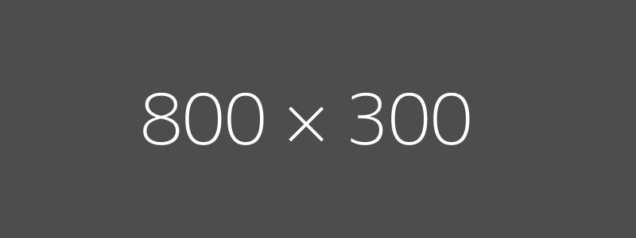

# 📤 Limit Sell Orders

### FAQ

Why didn't my limit order trigger?

A limit order may not have triggered for various reasons:

* The order considers the price impact of your potential swap. Even if the market price moved near the trigger, your order might move the price out of the trigger range.
* Swaps for that token may have been executed before yours in the block, influencing the token price and causing your order to fail.

What is the maximum expiry time for a limit order?

There is no limit on the expiry time you can use.

Why isn't my token in the list of available tokens to sell?

Each token balance must be worth at least 0.01 ETH to appear in the list of sellable tokens. On the ETH network, selling tokens worth less than 0.01 ETH will rarely be worth the gas costs.

What types of limit sell order are available?

* **Take Profit:** Enter a positive percentage for the Price Change (e.g., "50").&#x20;
* **Stop Loss:** Enter a negative percentage for the Price Change (e.g., "-20").&#x20;
* **Trailing Stop Loss:** Currently not available.

***

### Interface



<figure><figcaption>
Main screen (no token address entered)
</figcaption></figure>

* **Sell Amt** - Percentage amount of the token you intend to limit sell.&#x20;
* **Expiration** - The duration in hours before the order expires and is automatically canceled.
* **Price Change** - Percentage change for the limit sell to trigger. You can enter either a positive or negative number (i.e., Take Profit vs. Stop Loss).&#x20;
* **Delete Order** - Each limit order you create is presented in a numbered list under Existing Orders. To delete a limit order, simply enter its list number. For example, entering "2" would delete the limit order for that token.&#x20;
* **Select Tokens & Add Order** - The tokens held by each of your wallets are presented in a numbered list. Enter the list number of the token you want to sell. After inputting, your limit order will be created but not triggered.

***

<figure><figcaption>
Main screen (token address entered)
</figcaption></figure>

**Existing Orders** - Each new limit order you create is added to this list, providing a summary of each order.

***

<figure><figcaption>
After creating at least one limit order
</figcaption></figure>

**Select Order To Delete:** Entering "1" in the above example of **Existing Orders** would delete the Take Profit limit order for AAVE.

***

<figure><figcaption>
Delete Order
</figcaption></figure>

* **Sell Limit** - Navigate back to the sell limit menu.&#x20;
* **Support Ticket** - Open a support ticket regarding this specific transaction.&#x20;
* **Main Menu** - Return to the main menu.



<figure><figcaption>
Limit sell panel
</figcaption></figure>


The tokens in your wallets will be listed here. The value and price change % are auto-refreshed.


* **Create** - Opens a popup where you can configure and create a limit sell for that token on the given wallet. This button does not immediately sell your tokens when clicked.

***

<figure><figcaption>
Open orders
</figcaption></figure>

* **Expiration (Hours)** - The amount of hours before the order expires and is automatically cancelled.
* **% Amount to Sell** - Specify the % of tokens to sell.
* **Trigger Price (% Change)** - The % price decrease (stop-loss) or increase (take-profit) that should occur for the limit order to trigger.
* The example above is a Take Profit order, because tokens will be sold when the price increases. To create a Stop Loss, you may simply drag the **Trigger Price (% Change)** slider to a negative number.

***

<figure><figcaption>
Open orders
</figcaption></figure>

**Delete Order** - Click the trash icon on the limit order you would like to delete. Deletion occurs immediately and without confirmation.&#x20;



